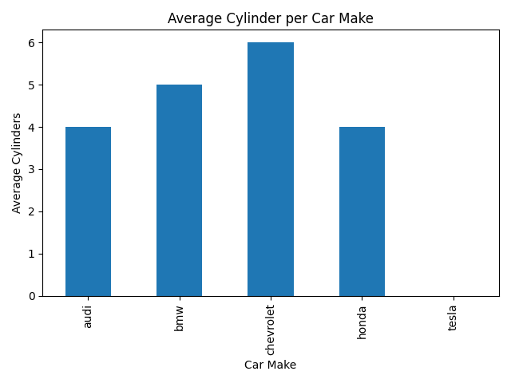
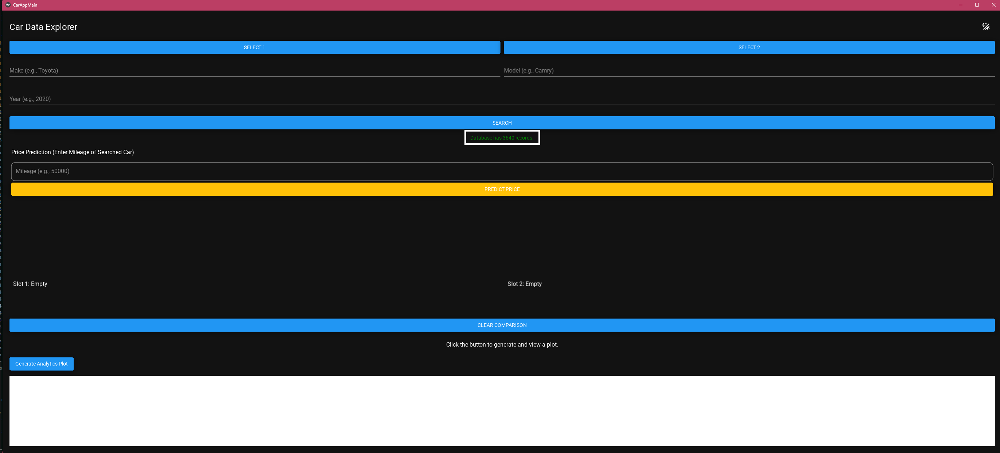
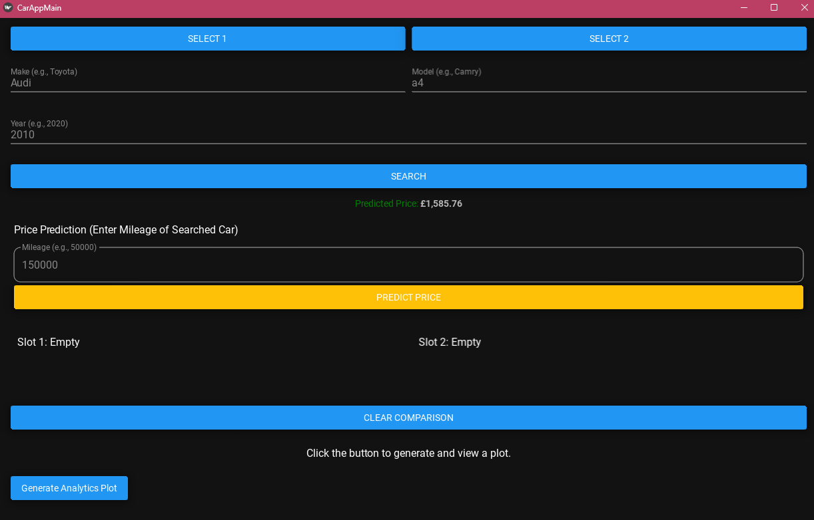

# 🚗 Car Data Explorer & Analytics Dashboard

An end-to-end desktop application that combines **Data Engineering**, **Machine Learning**, and **Exploratory Data Analysis (EDA)** to provide actionable insights into the automotive market. 

## 🚀 Project Overview

The Car Data Explorer is designed to transform raw automotive API data into a clean, interactive user experience. Rather than running scripts in a Jupyter Notebook, this project packages a full Machine Learning prediction pipeline and analytical dashboard into a standalone cross-platform GUI.

### ✨ Key Features

* **🔍 Interactive Car Search & Comparison:** Query live car specifications and compare technical metrics (horsepower, displacement, MPG) side-by-side.
* **🤖 Price Prediction Engine:** Integrates a Scikit-Learn `Pipeline` (Linear Regression + OneHotEncoding) to predict car valuations based on make, model, and mileage.
* **📊 Automated EDA:** Generates and displays visual analytics (e.g., average cylinders by make) dynamically within the application.
* **🗄️ Custom SQLite Backend:** Features a custom `DatabaseManager` for automated data ingestion, batch processing, and persistent storage.
* **⚡ Asynchronous GUI:** Built with KivyMD, utilizing multi-threading to ensure the UI remains responsive during API calls and database queries.

## 🏗️ Architecture & Project Structure

The repository is modularized to separate the UI layer from the data and machine learning logic:

Car-Data-Project/
│
├── main.py                   # App orchestrator & KivyMD GUI layer
├── requirements.txt          # Project dependencies
│
├── src/                      # Backend Logic
│   ├── dataset_ingester.py   # ETL pipeline for API/CSV ingestion
│   ├── database_manager.py   # SQLite connection and CRUD operations
│   ├── ml_pipeline.py        # Scikit-Learn model training & serialization
│   ├── data_analyser.py      # Pandas & Matplotlib EDA logic
│   ├── car_API.py            # API request handling
│   └── prediction_utils.py   # Data formatting for ML inference
│
├── database/                 # SQLite .db files
├── data/                     # Raw CSV datasets
├── models/                   # Serialized .joblib ML models
└── ui/                       # .kv design files and plot outputs

## ⚙️ Setup and Installation

    1. Clone the Repo:
    
    git clone [https://github.com/YourUsername/Car-Data-Project.git](https://github.com/YourUsername/Car-Data-Project.git)
    cd Car-Data-Project
    
    2. Set up the necessary environments
    python -m venv venv
    # Windows:
    .\venv\Scripts\activate
    # macOS/Linux:
    source venv/bin/activate
    
    
    3. Install the dependecies
    To run the backend server, use Docker. To run the desktop UI locally, install the frontend dependencies using pip install -r requirements-ui.txt.
    
    4. This project requires an API key from API-Ninjas. Update the src/car_API.py file with your credentials.

## 🏃‍♂️ How to Run the Pipeline

    To use the application, you must execute the pipeline in the correct order:
    
    1. Ingest Data: Populate the SQLite database with raw car data.
    Bash
    
    python src/dataset_ingester.py
    
    2. Train the ML Model: Train the Scikit-Learn pipeline and serialize it to the models/ directory.
    Bash
    
    python src/ml_pipeline.py
    
    3. Launch the Dashboard: Start the KivyMD application.
    Bash
    
    python main.py

##📈 Future Enhancements

    Advanced ML Models: Upgrade the predictive engine from Linear Regression to XGBoost or Random Forest for higher accuracy.

    Hyperparameter Tuning: Implement GridSearchCV within the training pipeline.

    Session State Persistence: Expand the SQLite schema to save user search history and previous vehicle comparisons.

### 📊 Exploratory Data Analysis (EDA)
To ensure the machine learning pipeline is fed high-quality, normalized data, this project includes a comprehensive EDA phase. Before training the model, the dataset was analyzed to:
* **Map Feature Correlations:** Identifying which variables (like mileage and year) most strongly impact car prices.
* **Check for Multicollinearity:** Ensuring the features fed into the `scikit-learn` model are distinct to prevent model confusion and overfitting.
* **Analyze Distributions:** Visualizing the target variable (price) and identifying any data skews or outliers in the UK used car market.

**[🔗 View the full EDA Notebook here](notebooks/eda_car_price_analysis.ipynb)**

### 🔧 Recent Improvements & Changes (August 2026)

*   **Backend API Modernization:** Upgraded `src/car_API.py` from synchronous script to a production-ready FastAPI microservice. Now serving on port 8000 with async support, Pydantic validation models for input data, and dedicated `/predict_price` endpoint that integrates the serialized ML model directly into HTTP requests.

*   **Docker Support:** Added Dockerfile enabling containerized deployment of backend server (`fastapi` + `uvicorn`) alongside local KivyMD desktop application development, making microservice deployment straightforward via docker-compose or standalone containers.

*   **Dual Requirements Structure:** Split dependencies:
    - [`requirements.txt`](C:\Users\samiu\Documents\Coded_Programs\Python\Car-Data-Project-master\requirements.txt) → Core backend (FastAPI, uvicorn, scikit-learn, pandas)
    - [`requirements_UI.txt`](C:\Users\samiu\Documents\Coded_Programs\Python\Car-Data-Project-master\requirements_UI.txt) → Frontend only (KivyMD and GUI), avoiding Kivy in backend venv.

*   **Localization:** Changed price display from USD ($ ) to GBP (£ ), making predictions relevant for UK used car market target audience.

The frontend application was developed using **KivyMD** to provide a clean, cross-platform Material Design interface. Rather than a standard terminal script, this UI makes the data accessible and interactive:
* **Asynchronous Execution:** Database queries, API calls, and ML inferences are routed through background threads, ensuring the application remains perfectly smooth and never freezes during heavy calculations.
* **Side-by-Side Comparison:** Users can store vehicles in memory slots to compare technical specifications (horsepower, MPG, etc.), with the app automatically highlighting the superior metrics.
* **Real-Time Valuations:** The dashboard hooks directly into the serialized `scikit-learn` model, allowing users to input custom mileage and instantly receive a predicted market price.

    
